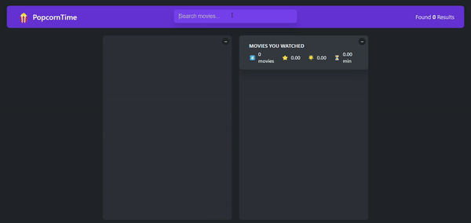

<h1 align="center">PopCorn Time</h1>

<h2 align="center">
Check out the <a href="">live PopCornTime App here</a>.
</h2>

<p align="center">
  
</p>

<p align="left">
usePopcorn is a react application that enables users to explore movies, give rating, and manage  watched movies list. By leveraging the OMDB API (Open Movie Database), the app gains access to an extensive movie database, allowing users to quickly and easily find movie information, including genre, cast, director, ratings, and much more. This application is a part of a course offered by Jonas Schmedtmann. I built the application when i took the course.
</p>

## Features

- Search for movies
- Show movies details
- Rate movies and add to watched list
- Remove movie from watched list
- Show watched movies details summery
- Use Enter key to start searching movie
- Use Esc key to close the movie detail
- watched movies stored in browser local storage

## Built with

- HTML5
- CSS3
- JavaScript
- React

## Installation

- Clone this repo:

```sh
git clone https://github.com/islam-solaiman/PopcornTime-Movie-App.git
```

- Install dependencies:

```sh
npm install
```

- Run the app:

```sh
npm start
```

## Author

<b>👤 Islam Solaiman</b>

- LinkedIn - [@Islam Solaiman](https://www.linkedin.com/in/islam-solaiman/)
- Github: [@islam Solaiman](https://github.com/islam-solaiman)

Feel free to contact me with any questions or feedback!


## Credits

This app was created as part of [Jonas Smechmann](https://twitter.com/jonasschmedtman)'s Udemy course [The Ultimate React Course 2024: React, Next.js, Redux & More](https://www.udemy.com/course/the-ultimate-react-course/?couponCode=KEEPLEARNING).

Special thanks to Jonas for his excellent teaching and guidance throughout the course.

## Show your support

Give a ⭐️ if you liked this project!